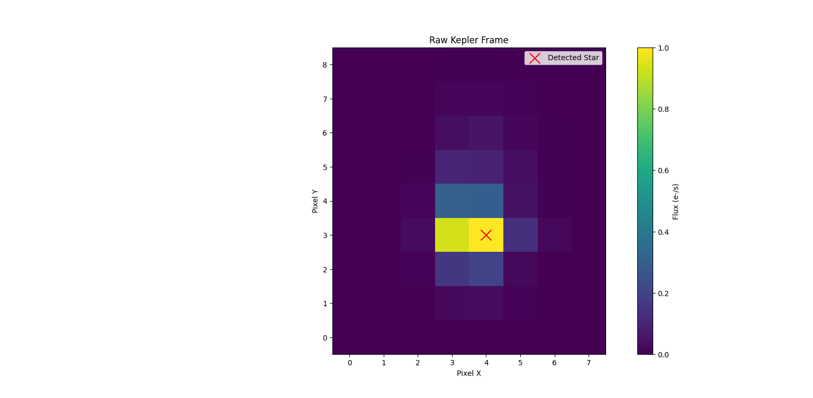
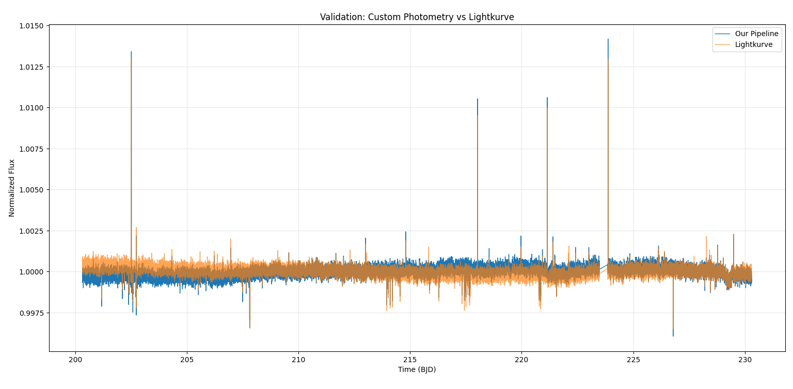

# 🌌 ExoVision-AI

> End-to-end AI pipeline for detecting exoplanet candidates from raw NASA telescope observations.


---

## 🚀 Overview

ExoVision-AI is an end-to-end machine learning project that aims to automate the process of detecting exoplanet candidates from raw telescope observations.

Instead of training directly on preprocessed light-curve datasets, this project reconstructs the scientific pipeline used in modern astronomy by converting raw telescope image sequences into light curves before applying deep learning models for exoplanet classification.

The goal is to bridge computer vision, astronomical image processing, photometry, and time-series machine learning into a single reproducible workflow.

---

## ⭐ Project Highlights

- Downloads real telescope observations directly from the NASA MAST archive.
- Reads and processes FITS Target Pixel Files.
- Implements custom flux-weighted centroid detection.
- Performs aperture photometry from raw telescope images.
- Generates stellar light curves without relying on built-in astronomy pipelines.
- Validates the custom implementation against the official Lightkurve library.
- Designed as a complete end-to-end exoplanet detection pipeline.

## 🔭 Pipeline

```text
NASA MAST Archive
        │
        ▼
Download Target Pixel Files (.fits)
        │
        ▼
Read FITS Image Cubes
        │
        ▼
Computer Vision
Locate Target Star
        │
        ▼
Aperture Photometry
Measure Brightness
        │
        ▼
Generate Light Curves
        │
        ▼
Deep Learning
(1D CNN / LSTM / Transformer)
        │
        ▼
Predict Exoplanet Probability
```

---

---

# 📊 Results

## Raw Kepler Target Pixel Frame

The image below shows a raw Target Pixel File (TPF) frame downloaded from the NASA MAST archive. The red marker indicates the detected stellar centroid, while the circular aperture is used to perform aperture photometry.



---

## Light Curve Validation

To validate the custom photometry pipeline, the generated light curve was compared against the official Lightkurve implementation.

The two curves closely overlap, demonstrating that the custom centroid detection and aperture photometry pipeline successfully reproduces the behavior of the reference astronomical software.




## 🛰 Features

- Read NASA FITS files
- Download Kepler/TESS observations from MAST
- Target star localization
- Aperture photometry
- Automatic light curve generation
- Deep learning-based exoplanet classification
- Interactive visualization
- Web deployment

---

## 🛠 Tech Stack

- Python
- NumPy
- Pandas
- OpenCV
- Astropy
- Lightkurve
- Photutils
- PyTorch
- Matplotlib
- Streamlit

---

## 📁 Project Structure

```
ExoVision-AI/

├── app/
├── data/
├── docs/
├── models/
├── notebooks/
├── src/
├── tests/
├── README.md
└── requirements.txt
```

---

## 🚧 Current Progress

- [x] Project initialization
- [x] Virtual environment setup
- [x] NASA MAST integration
- [x] Download Target Pixel Files
- [x] FITS/TPF reader
- [x] Raw frame visualization
- [x] Brightest pixel detection
- [x] Flux-weighted centroid detection
- [x] Circular aperture photometry
- [x] Generate custom light curves
- [x] Validate against Lightkurve
- [ ] Background subtraction
- [ ] Outlier removal
- [ ] Transit detection algorithm
- [ ] Feature extraction
- [ ] Machine learning classifier
- [ ] Streamlit deployment

---

## 🎯 Long-Term Goal

Build a complete AI system capable of converting raw astronomical observations into exoplanet probability predictions while maintaining a transparent and reproducible scientific workflow.

---

## 📜 License

MIT License